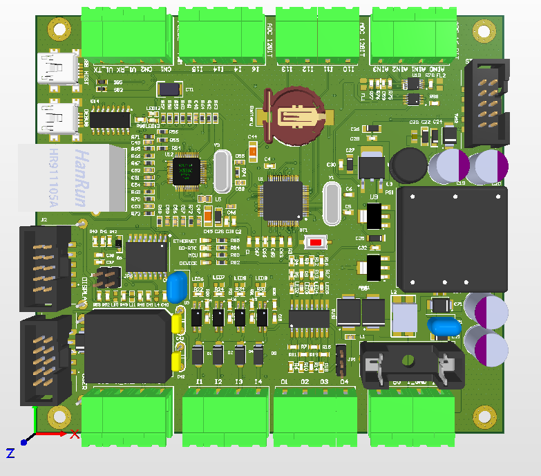
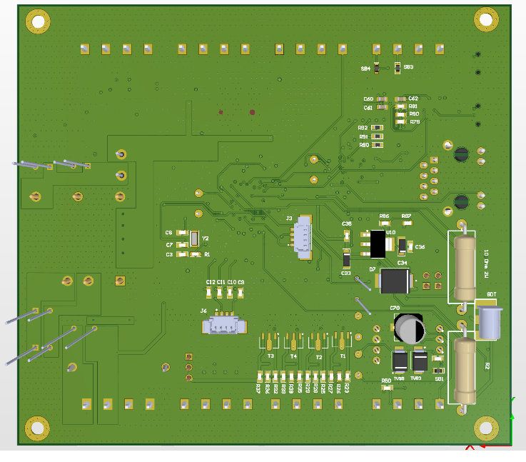
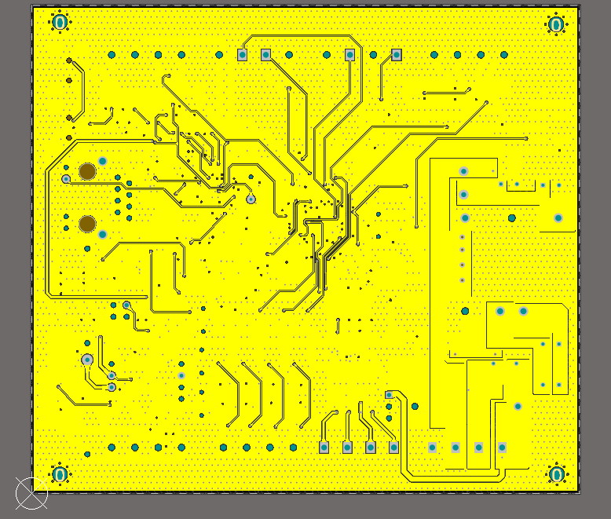
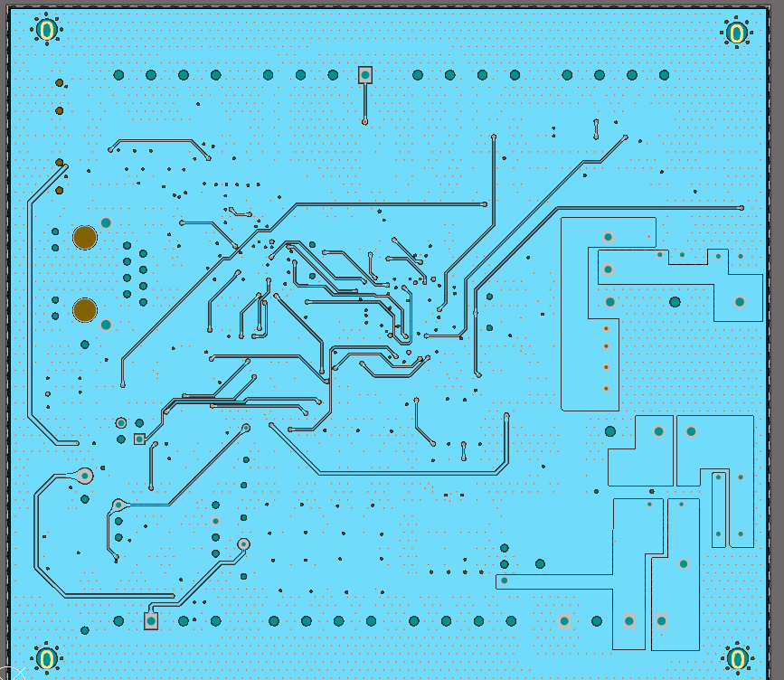
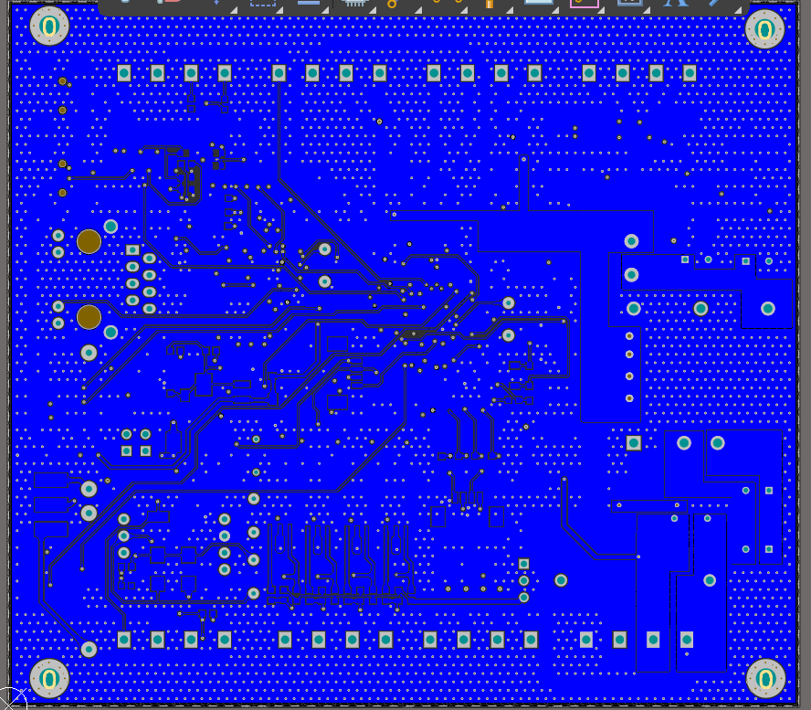

# README: IoT Agriculture Monitoring System

## 🌱 Project Overview
This project focuses on designing and developing an IoT-based monitoring system for agriculture using advanced hardware and communication technologies. The system supports real-time data collection, processing, and visualization to aid in predictive analysis for better crop management.

## 🛠️ Hardware Architecture
- **4-Layer PCB**: Custom-designed for efficient data transfer and hardware integration.
- **Ethernet Controller**: W5500 for reliable, high-speed networking.
- **Microcontrollers**: STM32F4 and ESP32 for sensor interfacing and control.
- **Edge Computing Platform**: Raspberry Pi 5 for data processing and analysis.
- **Analog Data Acquisition**: High-precision ADC for environmental monitoring.
- **Isolated GPIO**: Safe and interference-free sensor connections.
## Product Images

Here are images of the board from different perspectives:

| View         | Image                                                  |
|--------------|--------------------------------------------------------|
| **3d Top**|    |
| **3d Bottom**|                 |
| **Layout Top**|           |
| **Layout Middle 1**      |                 |
| **Layout Middle 2**   |           |
| **Layout Bottom**   |           |

## 📡 Communication Technologies
- **Cellular Networks**: 4G/5G modules using Mini PCIe on Raspberry Pi for wide-area connectivity.
- **Industrial Protocols**: Modbus and OPC UA for sensor communication.
- **Messaging Protocol**: MQTT Broker for lightweight and reliable data transfer.
- **Database Management**: MySQL for storing sensor data and analytical results.
- **USB Interface**: For local data access and firmware updates.

## ⚙️ Key Responsibilities
- **Hardware Design & Development**:
  - Designed and implemented a 4-layer PCB integrating Raspberry Pi 5, STM32F411, and W5500 Ethernet controller.
  - Developed mobile connectivity using Mini PCIe 4G/5G modules for robust edge computing.
- **Sensor Integration & Data Collection**:
  - Integrated various agricultural sensors to measure environmental parameters.
  - Optimized data acquisition and analog signal processing using STM32F4 MCU.
- **Communication & Data Transmission**:
  - Managed real-time data streams via MQTT Broker, ensuring low-latency communication.
  - Established secure and reliable data channels over 4G/5G networks.
- **Predictive Analytics & Computation**:
  - Implemented algorithms to analyze leaf condition, predict yield, and assess product quality.
  - Leveraged Raspberry Pi's processing power for on-device analysis.
- **Data Visualization & Monitoring**:
  - Built an intuitive monitoring dashboard with Node-RED.
  - Integrated MySQL database to store, retrieve, and display real-time sensor data.

## 🌐 System Workflow
1. **Sensor Data Acquisition**: Environmental sensors capture data (e.g., soil moisture, temperature, leaf condition).
2. **Edge Processing**: Data processed on Raspberry Pi for preliminary analysis.
3. **Data Transmission**: Processed data sent to MQTT Broker over 4G/5G.
4. **Cloud Database**: Data stored in MySQL for long-term analysis.
5. **User Interface**: Node-RED dashboard provides insights into crop health and growth predictions.

## 📖 Usage Instructions
1. **Hardware Setup**:
   - Assemble and connect sensors with STM32F411 MCU.
   - Insert 4G/5G Mini PCIe module into Raspberry Pi 5.
2. **Software Installation**:
   - Install Node-RED, MQTT Broker, and MySQL on the Raspberry Pi.
3. **Configuration**:
   - Configure sensor parameters and MQTT topics.
4. **Running the System**:
   - Power the devices and access the dashboard at `http://<raspberry_ip>:1880`.

## 🚀 Future Enhancements
- Integration of AI models for disease prediction.
- Expansion to support additional sensors for broader environmental monitoring.
- Optimization of communication protocols for higher efficiency.

## Contact

For any questions or additional support, feel free to reach out:

- **Name**: Mai Xuan Canh
- **University**: Ho Chi Minh City University of Technology (HCMUT)
- **Major**: Control and Automation Engineering
- **LinkedIn**: [Canh Mai's LinkedIn](https://www.linkedin.com/in/maixuancanh2003/)
- **Email**: canhmai.work@gmail.com
---
